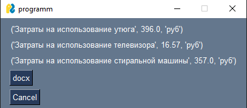

# Лабораторная работа №12
### Задание
По своему варианту задания и GUI фреймворка создайте пакет, содержащий 3 модуля, и подключите его к основной программе. 

Основная программа должна предоставлять:
графический пользовательский интерфейс с возможностями ввода требуемых параметров и отображения результатов расчёта, возможность сохранить результаты в отчёт формата .doc или .xls (например, пакеты `python-docx` и `openpyxl`).

Вариант 7:Бытовая техника

* Утюг
* Телевизор
* Стиральная машина 

Расчёт потребления электроэнергии и стоимости использования прибора за заданный период.

### Описание проделанной работы
Написал программы по варианту 7
Оформил отчёт в файле readme.md
### Примечание
Чтобы установить рабочую версию PySimpleGUI воспользуйтесь командой `pip install --extra-index-url https://PySimpleGUI.net/install PySimpleGUI`
#### Инструкция по запуску
1. Открыть папку XRevLab12 с помощью VSCodium
2. Вызвать консоль и прописать `gcc main.py -o result` 
3. прописать в консоли `./result` 

### Скриншот результата

### Ссылки
1. https://evil-teacher.on.fleek.co/prog_pm/term1/lab03/